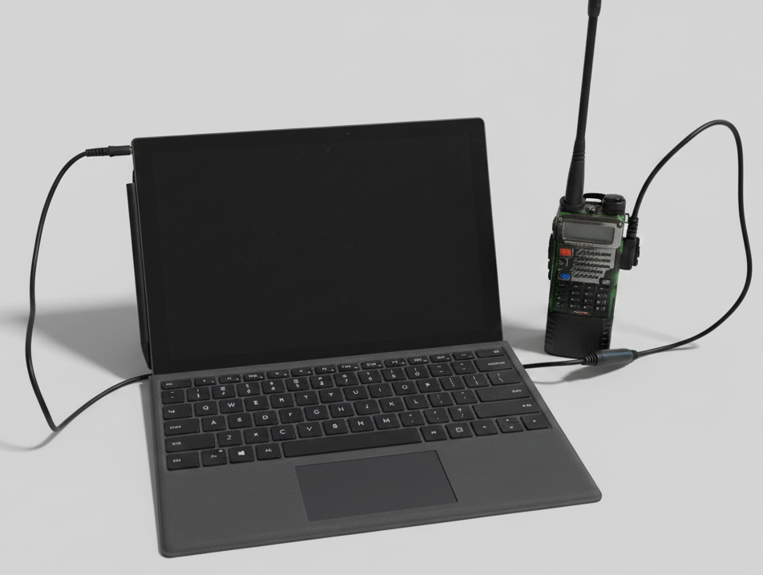

# RadioData - AFSK Audio Data Transfer

> AI-assisted development using Visual Studio with Copilot and Claude Sonnet 4.5 as the model and also Google Antigravity, Google Gemini 3, Claude Sonnet 4.5 as models.

Transfer text messages and files over audio using AFSK modulation for ham radio, walkie-talkies, or any audio link.


### Example Hardware Configuration



*Microsoft Surface tablet connected to Baofeng UV-5R radio via BTECH APRS-K2 cable*

---

## Disclaimer

This software is provided for educational purposes. Users assume all responsibility for its use. Verify compliance with local laws and regulations before transmitting on any frequency or channel.

## Features

- Text messaging up to 120 characters with encryption
- 10-character client identifiers for message attribution
- File transfer with 200-byte packet segmentation
- Optional 12-bit image compression (approximately 50% reduction)
- SHA256-based encryption with configurable keys (1-64 characters)
- Real-time audio frequency and volume monitoring
- Software loopback mode for testing
- Adjustable parameters for hardware optimization
- Persistent settings storage
- Progress tracking for file transfers
- Automatic file management with overwrite protection

## How It Works

RadioData uses Audio Frequency Shift Keying (AFSK) to encode digital data as audio tones:

- Mark (binary 1): 1200 Hz
- Space (binary 0): 2200 Hz
- Baud rate: 250 baud (4ms per bit)
- Sample rate: 44.1 kHz
- Compatible with APRS and packet radio standards

### Data Flow

1. Encoding: Text/files are encrypted, packetized, UART-framed, AFSK-modulated into audio
2. Transmission: Audio samples transmitted via sound card or radio
3. Decoding: Audio samples decoded via zero-crossing detection, UART decoding, and packet reassembly

### Packet Structure

```
[Sync: 0xAA 0x55] [Length: 1 byte] [Type: 1 byte] [Encrypted Payload] [Checksum: 1 byte]
```

Packet types: Text (0x01), File header (0x02), File chunk (0x03)

### Encryption

XOR cipher with SHA256-derived key. Password hashing provides avalanche effect where single character changes completely scramble output. Key caching optimizes performance.

## Getting Started

### Requirements

- Windows 10 or 11
- .NET 8.0 Runtime
- Audio hardware (built-in or APRS cable for radio)

### Installation

1. Download latest release or clone repository
2. Install .NET 8.0 Runtime if needed
3. Run RadioDataApp.exe

### Basic Usage

1. Configure client name (max 10 characters, auto-generated on first launch)
2. Select input and output audio devices (or use Loopback for testing)
3. Set encryption key (must match on both ends, default: "RADIO")
4. Send text messages or files
5. Received files saved automatically to ReceivedFiles folder

For radio use, enable VOX on the radio to allow PC transmission. Set squelch low enough for signal detection. Use clear, unoccupied frequencies.

### Advanced Tuning

Parameters available for optimization:

- **Squelch Threshold** (0.000-0.100): Minimum signal strength, default 0.01
- **Input Gain** (0.5x-2.0x): Signal amplification, default 1.0x
- **Zero-Crossing Threshold** (10-20): Frequency discrimination, default 14
- **Start Bit Compensation** (-5.0 to +5.0): Timing offset, default -2.0

All settings persist automatically between sessions.

## Troubleshooting

### Unidirectional Communication

Often caused by hardware differences. Solutions:

1. Check for ambient noise in System Log
2. Increase Squelch Threshold to 0.02-0.05 if needed
3. Adjust Input Gain (1.5x for weak signals, 0.8x for strong)
4. Modify Zero-Crossing Threshold (12 for high frequency sensitivity, 16 for low)

### Radio Compatibility

Note that identical radio models may require different settings due to:

- Output audio level variations
- Sound card sensitivity differences
- VOX trigger thresholds

Recommendations:
- Test in loopback mode first
- Start with 50% radio volume, adjust Input Gain
- Monitor RMS levels (target 0.01 to 0.5, avoid 1.0)

#### Baofeng UV-5R Specific Settings

When using Baofeng UV-5R radios:

- **VOX Setting**: Set VOX level to 1 (lowest sensitivity works best)
- **Time-Out Timer (TOT)**: Default is 60 seconds. For files requiring longer transmission:
  - Access menu item 34 (TOT)
  - Set to 180 seconds (3 minutes) or higher
  - Files over 60 seconds will fail with default TOT setting
- **Volume**: Set radio volume to 50-75%
- **Windows Output**: Keep Windows output volume at 50-75%

### Common Issues

| Issue | Solution |
|-------|----------|
| No audio output | Verify device selection and mode |
| No audio input | Check device selection and permissions |
| Checksum failures | Adjust Input Gain or Zero-Crossing |
| Random noise decoding | Increase Squelch Threshold |
| Clipping warnings | Reduce Input Gain |
| VOX not triggering | Increase radio or output volume |
| Transfer stops at 60s | Increase TOT setting (Menu 34 on UV-5R) |
| Red TX light flickers | Increase output volume or VOX level |

## Technical Details

### Modulation

- Baud rate: 250 baud
- Mark/Space: 1200Hz / 2200Hz
- Sample rate: 44.1 kHz
- Amplitude: 50% maximum
- Preamble: 1200ms for first packet
- Phase continuity: Maintained across all packets in file transfer

### Protocol

- Maximum packet: 255 bytes
- File chunks: 200 bytes
- Text limit: 120 characters
- Speed: ~250 bits/second
- Packet time: ~9.5 seconds (first packet ~13.5s)

### Timeouts

- Silence: 2 seconds without packets triggers dead air detection
- Total: Calculated based on expected transmission time plus buffer
- Transfer abandonment: New transmission automatically supersedes incomplete transfer

### Architecture

- MVVM pattern with partial classes
- NAudio for audio I/O
- CommunityToolkit.MVVM for bindings
- MaterialDesignThemes for UI

## Building from Source

### Prerequisites

- Visual Studio 2022 or later
- .NET 8.0 SDK
- Windows 10/11

### Dependencies

- NAudio 2.2.1
- CommunityToolkit.Mvvm 8.4.0
- MaterialDesignThemes 5.3.0

### Build Commands

```bash
git clone https://github.com/MDReptile/RadioData.git
cd RadioData
dotnet build RadioDataApp/RadioDataApp.csproj
dotnet run --project RadioDataApp/RadioDataApp.csproj
```

## License

Open source. Use, modify, and distribute freely.
