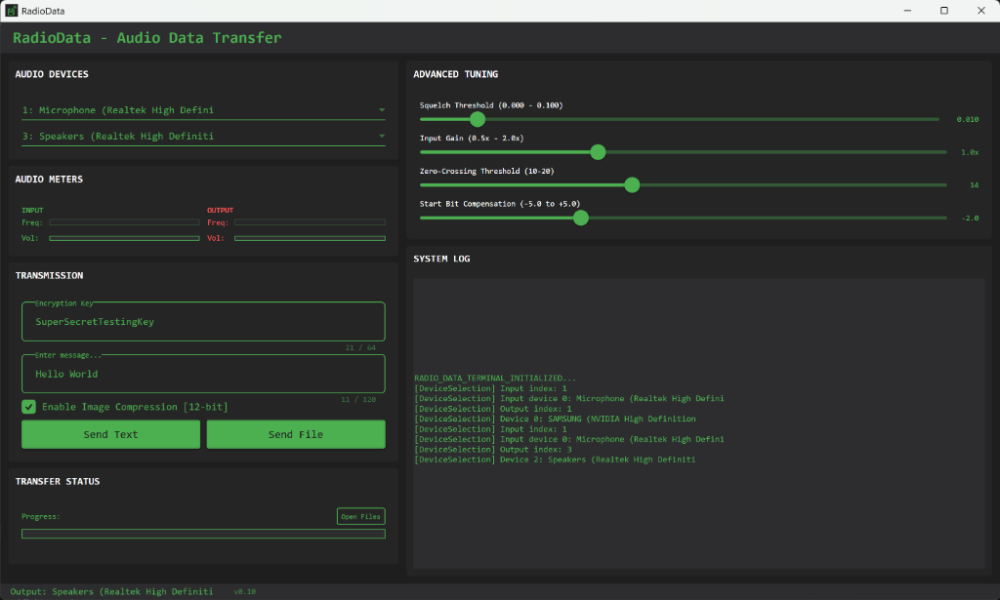

# RadioData Terminal

**RadioData Terminal** is a robust, "hacker-style" application designed for reliable data transmission over audio frequencies (AFSK). It enables text messaging and file transfer between computers using standard radio transceivers or audio cables.

## Key Features

### 📡 Reliable AFSK Modem
- **500 Baud Rate**: Optimized for reliability over noisy radio channels.
- **Smart Preamble**: Automatically handles VOX activation to prevent initial data loss.
- **Continuous Transmission**: Streams audio packet-by-packet to keep the radio's VOX open during long file transfers.

### 📁 Robust File Transfer
- **Packet Reassembly**: Uses Sequence IDs to correctly place file chunks, preventing corruption from out-of-order delivery.
- **Received Files Organizer**: Automatically saves and organizes incoming files into a dedicated directory.
- **Compression**: Built-in 12-bit image compression reduces transmission time by ~50% for standard image formats.

### 🎛️ Dual Metering System
- **Real-time Visualization**: Displays both **Frequency** (Tone) and **Volume** (Amplitude) for Input and Output.
- **Smart UI**: Frequency bars dim automatically when silence is detected to reduce visual noise.

### 🎨 Terminal Aesthetic
- **Dark Theme**: High-contrast Dark Gray (`#1E1E1E`) and Terminal Green (`#00FF41`) design.
- **Responsive Layout**: Optimized for usability with clear status indicators and logs.

## Core Components

- **`AfskModem.cs`**: The heart of the system. Handles modulation (Text/Bytes -> Audio) and demodulation (Audio -> Text/Bytes).
- **`AudioService.cs`**: Manages audio devices using `NAudio`. Implements `BufferedWaveProvider` for seamless, gap-free transmission.
- **`FileTransferService.cs`**: Orchestrates file packetization, reassembly, and storage. Handles the custom protocol logic.
- **`ImageCompressionService.cs`**: Implements custom 12-bit color packing to compress images for faster radio transmission.
- **`MainViewModel.cs`**: The brain of the UI. Connects all services, handles metering logic, and manages application state.

## Getting Started

1. **Select Devices**: Choose your Microphone (Input) and Speaker (Output) from the dropdowns.
2. **Tune Radio**: Ensure your radio is set to VOX mode if using a transceiver.
3. **Transmit**:
   - Type a message and click **TX_MESSAGE**.
   - Or click **TX_FILE** to send a document or image.
4. **Receive**: The app automatically listens for incoming signals. Received files will appear in the `ReceivedFiles` folder.

## Requirements
- .NET 8.0
- Windows OS (WPF)
- Microphone & Speakers (or Virtual Audio Cable)
